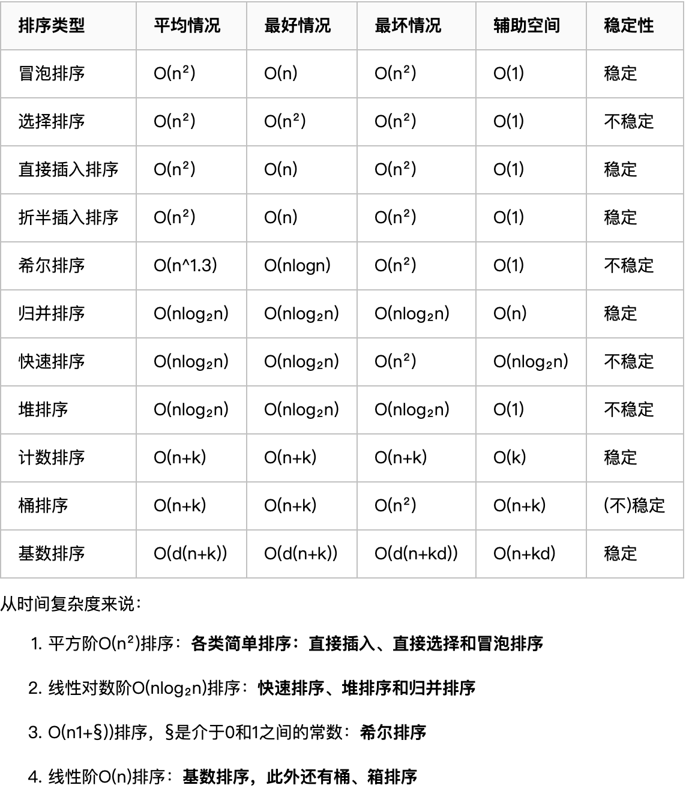

# 排序算法

## 直接插入排序

### 基本思想

通常人们整理桥牌的方法是一张一张的来，将每一张牌插入到其他已经有序的牌中的适当位置。在计算机的实现中，为了要给插入的元素腾出空间，我们需要将其余所有元素在插入之前都向右移动一位。

```java
public static void sort(int[] a) {
    for (int i = 0; i < a.length - 1; i++) {
        for (int j = i + 1; j > 0; j--) {
            if (a[j] < a[j - 1]) {
                int temp = a[j];
                a[j] = a[j - 1];
                a[j - 1] = temp;
            }
        }
    }
}
```

### 复杂度分析

平均时间复杂度O(n<sup>2</sup>)					空间复杂度O(1)

## 希尔排序

希尔排序，也称 **递减增量排序算法**，是插入排序的一种更高效的改进版本。希尔排序是 **非稳定排序算法**。

希尔排序是基于插入排序的以下两点性质而提出改进方法的：

- 插入排序在对几乎已经排好序的数据操作时，效率高，即可以达到线性排序的效率
- 但插入排序一般来说是低效的，因为插入排序每次只能将数据移动一

希尔排序是先将整个待排序的记录序列分割成为若干子序列分别进行直接插入排序，待整个序列中的记录“基本有序”时，再对全体记录进行依次直接插入排序。

### 基本思想

将待排序数组按照步长gap进行分组，然后将每组的元素利用直接插入排序的方法进行排序；每次再将gap折半减小，循环上述操作；当gap=1时，利用直接插入，完成排序。

可以看到步长的选择是希尔排序的重要部分。只要最终步长为1任何步长序列都可以工作。一般来说最简单的步长取值是**初次取数组长度的一半**为增量，之后每次再减半，直到增量为1。

```java
public static void sort(int[] a) {
    int length = a.length;
    int h = 1;
    while (h < length / 3) h = 3 * h + 1;
    for (; h >= 1; h /= 3) {
        for (int i = 0; i < a.length - h; i += h) {
            for (int j = i + h; j > 0; j -= h) {
                if (a[j] < a[j - h]) {
                    int temp = a[j];
                    a[j] = a[j - h];
                    a[j - h] = temp;
                }
            }
        }
    }
}
```

### 复杂度分析

平均时间复杂度O(nlog<sub>2</sub>n)				空间复杂度 O(1)

## 简单选择排序

### 基本思想

选择排序（Selection sort）是一种简单直观的排序算法。它的工作原理如下。首先在未排序序列中找到最小（大）元素，存放到排序序列的起始位置，然后，再从剩余未排序元素中继续寻找最小（大）元素，然后放到已排序序列的末尾。以此类推，直到所有元素均排序完毕。

```java
public static void sort(int[] a) {
    for (int i = 0; i < a.length; i++) {
        int min = i;
        //选出之后待排序中值最小的位置
        for (int j = i + 1; j < a.length; j++) {
            if (a[j] < a[min]) {
                min = j;
            }
        }
        //最小值不等于当前值时进行交换
        if (min != i) {
            int temp = a[i];
            a[i] = a[min];
            a[min] = temp;
        }
    }
}
```

### 复杂度分析

平均时间复杂度O(n<sup>2</sup>)					空间复杂度O(1)

## 堆排序

把此序列对应的二维数组看成一个完全二叉树。那么堆的含义就是：**完全二叉树中任何一个非叶子节点的值均不大于（或不小于）其左，右孩子节点的值。** 由上述性质可知大顶堆的堆顶的关键字肯定是所有关键字中最大的，小顶堆的堆顶的关键字是所有关键字中最小的。因此我们可使用大顶堆进行升序排序, 使用小顶堆进行降序排序。

### 基本思想

以大顶堆为例，堆排序的过程就是将待排序的序列构造成一个堆，选出堆中最大的移走，再把剩余的元素调整成堆，找出最大的再移走，重复直至有序。

```java
public static void sort(int[] a) {

    for (int i = a.length - 1; i > 0; i--) {
        max_heapify(a, i);

        //堆顶元素(第一个元素)与Kn交换
        int temp = a[0];
        a[0] = a[i];
        a[i] = temp;
    }
}

/***
 *  将数组堆化
 *  i = 第一个非叶子节点。
 *  从第一个非叶子节点开始即可。无需从最后一个叶子节点开始。
 *  叶子节点可以看作已符合堆要求的节点，根节点就是它自己且自己以下值为最大。
 */
public static void max_heapify(int[] a, int n) {
    int child;
    for (int i = (n - 1) / 2; i >= 0; i--) {
        //左子节点位置
        child = 2 * i + 1;
        //右子节点存在且大于左子节点，child变成右子节点
        if (child != n && a[child] < a[child + 1]) {
            child++;
        }
        //交换父节点与左右子节点中的最大值
        if (a[i] < a[child]) {
            int temp = a[i];
            a[i] = a[child];
            a[child] = temp;
        }
    }
}
```

### 复杂度分析

平均时间复杂度 O(nlog<sub>2</sub>n) 						空间复杂度O(1)

## 冒泡排序

### 基本思想

冒泡排序（Bubble Sort）是一种简单的排序算法。它重复地走访过要排序的数列，一次比较两个元素，如果他们的顺序错误就把他们交换过来。走访数列的工作是重复地进行直到没有再需要交换，也就是说该数列已经排序完成。这个算法的名字由来是因为越小的元素会经由交换慢慢“浮”到数列的顶端。

```java
public static void sort(int[] a) {
    //外层循环控制比较的次数
    for (int i = 0; i < a.length - 1; i++) {
      //内层循环控制到达位置
        for (int j = 0; j < a.length - i - 1; j++) {
            //前面的元素比后面大就交换
            if (a[j] > a[j + 1]) {
                int temp = a[j];
                a[j] = a[j + 1];
                a[j + 1] = temp;
            }
        }
    }
}
```

### 复杂度分析

平均时间复杂度 O(n<sup>2</sup>)						空间复杂度 O(1)

## 快速排序

在平均状况下，排序 n 个项目要 Ο(nlogn) 次比较。在最坏状况下则需要 Ο(n2) 次比较，但这种状况并不常见。事实上，快速排序通常明显比其他 Ο(nlogn) 算法更快，因为它的内部循环（inner loop）可以在大部分的架构上很有效率地被实现出来。

### 基本思想

快速排序的基本思想：**挖坑填数+分治法**。

快速排序使用分治法（Divide and conquer）策略来把一个串行（list）分为两个子串行（sub-lists）。

快速排序又是一种分而治之思想在排序算法上的典型应用。本质上来看，快速排序应该算是在冒泡排序基础上的递归分治法。

快速排序的名字起的是简单粗暴，因为一听到这个名字你就知道它存在的意义，就是快，而且效率高！它是处理大数据最快的排序算法之一了。虽然 Worst Case 的时间复杂度达到了 O(n²)，但是人家就是优秀，在大多数情况下都比平均时间复杂度为 O(n logn) 的排序算法表现要更好。

```java
// 递归版的快速排序：通过把基准插入到合适的位置来实现分治，并递归地对分治后的两个划分继续快排。
public static void sort(int[] a, int low, int high) {
    //已经排完
    if (low >= high) {
        return;
    }
    int left = low;
    int right = high;

    //保存基准值
    int pivot = a[left];
    while (left < right) {
        //从后向前找到比基准小的元素
        while (left < right && a[right] >= pivot)
            right--;
        a[left] = a[right];
        //从前往后找到比基准大的元素
        while (left < right && a[left] <= pivot)
            left++;
        a[right] = a[left];
    }
    // 放置基准值，准备分治递归快排
    a[left] = pivot;
    sort(a, low, left - 1);
    sort(a, left + 1, high);
}
```

```java
// 因为 递归的本质是栈 ，所以我们非递归实现的过程中，可以借助栈来保存中间变量就可以实现非递归了。在这里中间变量也就是通过Pritation函数划分区间之后分成左右两部分的首尾指针，只需要保存这两部分的首尾指针即可。
public static void sortByStack(int[] a) {
    Stack<Integer> stack = new Stack<Integer>();

    //初始状态的左右指针入栈
    stack.push(0);
    stack.push(a.length - 1);
    while (!stack.isEmpty()) {
        //出栈进行划分
        int high = stack.pop();
        int low = stack.pop();

        int pivotIndex = partition(a, low, high);

        //保存中间变量
        if (pivotIndex > low) {
            stack.push(low);
            stack.push(pivotIndex - 1);
        }
        if (pivotIndex < high && pivotIndex >= 0) {
            stack.push(pivotIndex + 1);
            stack.push(high);
        }
    }
}

private static int partition(int[] a, int low, int high) {
    if (low >= high) return -1;
    int left = low;
    int right = high;
    //保存基准的值
    int pivot = a[left];
    while (left < right) {
        //从后向前找到比基准小的元素，插入到基准位置中
        while (left < right && a[right] >= pivot) {
            right--;
        }
        a[left] = a[right];
        //从前往后找到比基准大的元素
        while (left < right && a[left] <= pivot) {
            left++;
        }
        a[right] = a[left];
    }
    //放置基准值，准备分治递归快排
    a[left] = pivot;
    return left;
}
```

### 复杂度分析

平均时间复杂度 O(nlog<sub>2</sub>n)				空间复杂度O(1)

## 归并排序

### 基本思想

归并排序算法是将两个（或两个以上）有序表合并成一个新的有序表，即把待排序序列分为若干个子序列，每个子序列是有序的。然后再把有序子序列合并为整体有序序列。

归并排序其实要做两件事：

- 分解：将序列每次折半拆分
- 合并：将划分后的序列段两两排序合并

因此，归并排序实际上就是两个操作，拆分+合并

```java
// 递归
public class Merge {

    //归并所需的辅助数组
    private static int[] aux;

    public static void sort(int[] a) {
        //一次性分配空间
        aux = new int[a.length];
        sort(a, 0, a.length - 1);
    }

    public static void sort(int[] a, int low, int high) {
        if (low >= high) {
            return;
        }
        int mid = (low + high) / 2;
        //将左半边排序
        sort(a, low, mid);
        //将右半边排序
        sort(a, mid + 1, high);
        merge(a, low, mid, high);
    }

    /**
     * 该方法先将所有元素复制到aux[]中，然后在归并会a[]中。方法在归并时(第二个for循环)
     * 进行了4个条件判断：
     * - 左半边用尽(取右半边的元素)
     * - 右半边用尽(取左半边的元素)
     * - 右半边的当前元素小于左半边的当前元素(取右半边的元素)
     * - 右半边的当前元素大于等于左半边的当前元素(取左半边的元素)
     * @param a
     * @param low
     * @param mid
     * @param high
     */
    public static void merge(int[] a, int low, int mid, int high) {
        //将a[low..mid]和a[mid+1..high]归并
        int i = low, j = mid + 1;
        for (int k = low; k <= high; k++) {
            aux[k] = a[k];
        }

        for (int k = low; k <= high; k++) {
            if (i > mid) {
                a[k] = aux[j++];
            } else if (j > high) {
                a[k] = aux[i++];
            } else if (aux[j] < aux[i]) {
                a[k] = aux[j++];
            } else {
                a[k] = aux[i++];
            }
        }
    }

}
```

### 复杂度分析

平均时间复杂度 O(nlog<sub>2</sub>n)					空间复杂度 O(n)

## 基数排序

### 基本思想

将所有待比较数值（正整数）统一为同样的数位长度，数位较短的数前面补零。然后，从最低位开始，依次进行一次排序。这样从最低位排序一直到最高位排序完成以后，数列就变成一个有序序列。

基数排序按照优先从高位或低位来排序有两种实现方案：

- **MSD（Most significant digital） 从最左侧高位开始进行排序**。先按k1排序分组, 同一组中记录, 关键码k1相等, 再对各组按k2排序分成子组, 之后, 对后面的关键码继续这样的排序分组, 直到按最次位关键码kd对各子组排序后. 再将各组连接起来, 便得到一个有序序列。*MSD方式适用于位数多的序列*。
- **LSD （Least significant digital）从最右侧低位开始进行排序**。先从kd开始排序，再对kd-1进行排序，依次重复，直到对k1排序后便得到一个有序序列。*LSD方式适用于位数少的序列*。

```java
public static void sort(int[] arr) {
    if (arr.length <= 1) return;

    //取得数组中的最大数，并取得位数
    int max = 0;
    for (int i = 0; i < arr.length; i++) {
        if (max < arr[i]) {
            max = arr[i];
        }
    }
    int maxDigit = 1;
    while (max / 10 > 0) {
        maxDigit++;
        max = max / 10;
    }
    //申请一个桶空间
    int[][] buckets = new int[10][arr.length];
    int base = 10;

    //从低位到高位，对每一位遍历，将所有元素分配到桶中
    for (int i = 0; i < maxDigit; i++) {
        int[] bktLen = new int[10];        //存储各个桶中存储元素的数量

        //分配：将所有元素分配到桶中
        for (int j = 0; j < arr.length; j++) {
            int whichBucket = (arr[j] % base) / (base / 10);
            buckets[whichBucket][bktLen[whichBucket]] = arr[j];
            bktLen[whichBucket]++;
        }

        //收集：将不同桶里数据挨个捞出来,为下一轮高位排序做准备,由于靠近桶底的元素排名靠前,因此从桶底先捞
        int k = 0;
        for (int b = 0; b < buckets.length; b++) {
            for (int p = 0; p < bktLen[b]; p++) {
                arr[k++] = buckets[b][p];
            }
        }
        System.out.println("Sorting: " + Arrays.toString(arr));
        base *= 10;
    }
}
```

### 复杂度分析

平均时间复杂度O(d*(n+r))				空间复杂度O(n+r)

其中，**d 为位数，r 为基数，n 为原数组个数**。



